# yolo4_tensorflow2
yolo 4th edition  implemented by tensorflow2.0

[TOC]


## 综述

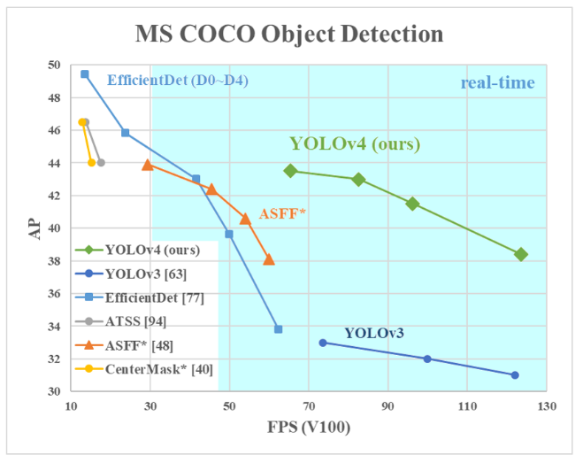

对于那些在GPU平台上运行的检测器，它们的主干网络可能为VGG、ResNet、ResNeXt或DenseNet。

而对于那些在CPU平台上运行的检测器，他们的检测器可能为SqueezeNet ，MobileNet， ShufflfleNet。

最具代表性的二阶段目标检测器R-CNN系列，包括fast R-CNN，faster R-CNN ，R-FCN [9]，Libra R-CNN。也可以使得二阶段目标检测器成为anchor-free目标检测器，例如RepPoints。至于一阶段目标检测器，最具代表性的网络包括YOLO、SSD、RetinaNet。

一阶段的anchor-free目标检测器在不断发展，包括CenterNet、CornerNet、FCOS等。在近些年来的发展，目标检测器通常是在头部和主干网络之间加入一些层，这些层被用来收集不同阶段的特征图,拥有这种机制的网络包括Feature Pyramid Network (FPN)，Path Aggregation Network (PAN)，BiFPN和NAS-FPN。

除了上述模型外，一些研究人员将重心放在了研究主干网络上（DetNet，DetNAS），而还有一些研究人员则致力于构建用于目标检测的新的模型（SpineNet，HitDetector）。

总的来说，一般的目标检测器由以下几部分组成：

- Input: Image, Patches, Image Pyramid

- Backbones: VGG16, ResNet-50,SpineNet，EffificientNet-B0/B7, CSPResNeXt50， CSPDarknet53

- Neck:

- Additional blocks: SPP,ASPP,RFB，SAM

- Path-aggregation blocks: FPN，PAN，NAS-FPN，Fully-connected FPN，BiFPN，ASFF，SFAM

- Heads:

- Dense Prediction(one-stage):

  - RPN，SSD，YOLO，RetinaNet(anchor based)

  - CornerNet，CenterNet，MatrixNet，FCOS(anchor free)

-  Sparse Prediction(two-stage):

- - Faster R-CNN，R-FCN，Mask R-CNN(anchor based)
  - RepPoints（anchor free）

### BOF

Bag of freebies：通常，传统的目标检测器都是离线训练的。因此，研究人员经常喜欢利用这一优点来开发一种更好的训练方法，使得在不增加推理成本的情况下提升目标检测器的精度。我们称这些仅仅改变了训练策略或增加了训练成本的方法为“Bag of freebies”。目前通常采用的方法使数据增强。数据增强的目的是增加输入图像的灵活性，因此设计的目标检测器有着更高的鲁棒性。

### BOS

Bag of specials：对于那些增加模块和后处理的方法，它们仅仅少量的增加了推理成本，却能够显著地提升目标检测精度，我们称之为“bag of specials”。一般说来，这些插入的模块是用来增强某些属性，例如增强感受野，引入警示机制或增强特征的集成能力等。而后处理则用来筛选模型的预测结果。

### Selection of BoF and BoS

为了改进目标检测训练，CNN通常使用如下内容：

- Activations: ReLU, leaky-ReLU, parametric-ReLU,ReLU6, SELU, Swish, or Mish
- Bounding box regression loss: MSE, IoU, GIoU,CIoU, DIoU
- Data augmentation: CutOut, MixUp, CutMix
- Regularization method: DropOut, DropPath，Spatial DropOut [79], or DropBlock
- Normalization of the network activations by their mean and variance: Batch Normalization (BN) ，Cross-GPU Batch Normalization (CGBN or SyncBN)，Filter Response Normalization (FRN) [70], or Cross-Iteration Batch Normalization (CBN)
- Skip-connections: Residual connections, Weighted residual connections, Multi-input weighted residual connections, or Cross stage partial connections (CSP)

### Additional improvements

为了使我们设计的目标检测器更加适合在单GPU上训练，我们有如下的设计和改进：

- 引入Mosaic, and Self-Adversarial Training (SAT)的数据增广方式
- 应用遗传算法选择最优超参数
- 修改现有的方法使之更适合训练和检测- modifified SAM, modifified PAN, and Cross mini-Batch Normalization (CmBN)

Mosaic代表了一种新的数据增广方式。它混合了四张训练图像。因此，四种不同的上下文被混合，而CutMix只混合两个输入图像。这使得能够检测正常背景之外的目标。

Self-Adversarial Training (SAT)同样代表了一种数据混合方式，分两个阶段进行。

CmBN为CBN的修改版，定义为Cross mini-Batch Normalization（CmBN），它仅仅在一个batch之中收集小批量统计信息。

我们将SAM从spatial-wise attention改为point-wise attention。同时，替换PAN到concatenation的连接。

### 导图

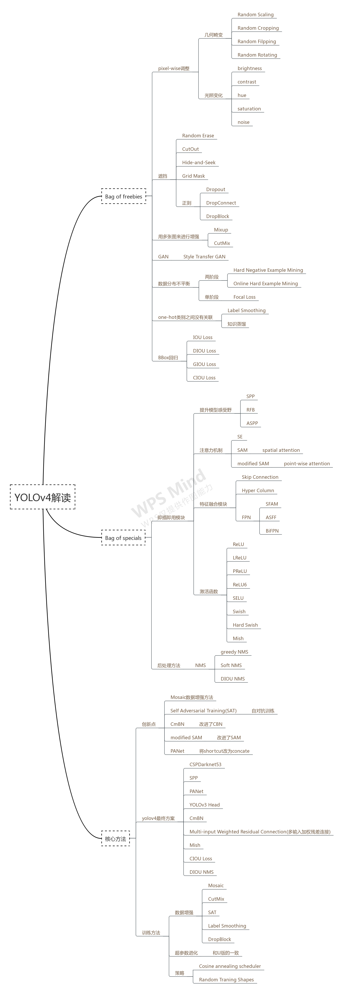

## 论文研读

yolo4的主要改进点：

**骨干网络训练阶段优化**

- [x] 数据增强Mosaic data augmentation
- [x] 正则化DropBlock regularization
- [x] 类标签平滑Class label smoothing
- [x] Cutmix

**骨干网络检测阶段优化**

- [x] Mish 激活 Mish-activation
- [x] Cross-stage partial connections (CSP)
- [ ] Multi-input weighted residual connections (MiWRC)加权残差连接

**detector训练阶段优化**

- [ ] 损失CIoU loss
- [ ] Cross mini-Batch Normalization (CmBN)
- [x] 正则化DropBlock regularization
- [x] 数据增强Mosaic data augmentation
- [ ] 自对抗训练Self-adversarial-training (SAT)
- [ ] Eliminate grid sensitivity
- [ ] Using multiple anchors for a single ground truth
- [ ] Cosine annealing scheduler
- [ ] 使用遗传算法选择最优超参数Optimal hyper-parameters
- [ ] Random training shapes

**detector检测阶段优化**

- [x] Mish 激活 Mish-activation
- [x] SPP-block
- [ ] SAM-block
- [x] PAN path-aggregation block
- [ ] DIoU-NMS

### 1.WRC


### 2.CSP

Cross Stage Partial Network(CSPNet)就是从网络结构设计的角度来解决以往工作在推理过程中需要很大计算量的问题。

CSPNet做backbone可以极大提升模型的准确率，在同等FPS的情况下，CSPNet准确率更有竞争力。

CSPNet提出主要是为了解决三个问题：

- 增强CNN的学习能力，能够在轻量化的同时保持准确性。
- 降低计算瓶颈
- 降低内存成本

### 3.CmBN


### 4.SAT 

- [ ] todo

我的理解是利用GAN网络，反向训练对图片进行扰动，然后在这个图片上进行训练

### 5.Mish

平滑的激活函数允许更好的信息深入神经网络，从而得到更好的准确性和泛化。

Mish=x * tanh(ln(1+e^x))。

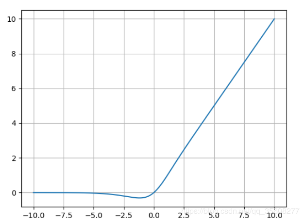

yolo4只在backbone中使用的该激活函数,其他为LeakRelu

### 6.Mosaic data augmnetation

数据增强的几种方式：

- Mixup:将随机的两张样本按比例混合，分类的结果按比例分配；
- Cutout:随机的将样本中的部分区域cut掉，并且填充0像素值，分类的结果不变；
- CutMix:就是将一部分区域cut掉但不填充0像素而是随机填充训练集中的其他数据的区域像素值，分类结果按一定的比例分配
- Mosaic：就是图像拼接，将多张图片拼接成一张（论文中Mosaic 混合了 4 张图像，而 CutMix 混合了两张）
- 翻转，旋转，裁剪，变形，缩放
- 噪声、模糊、颜色变换、擦除、填充

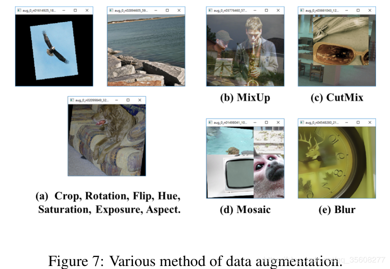

### 7.DropBlock regularization

DropBlock regularization是一种针对卷积层的正则化方法。

​		原来的dropout方法多是作用在全连接层上，在卷积层应用dropout方法意义不大。文章认为是因为每个featuremap的位置都有一个感受野范围，仅仅对单个像素位置进行dropout并不能降低featuremap学习的特征范围，也就是说网络仍可以通过该位置的相邻位置元素去学习对应的语义信息，也就不会促使网络去学习更加鲁邦的特征。既然单独的对每个位置进行dropout并不能提高网络的泛化能力，那么很自然的，如果我们按照一块一块的去dropout，就自然可以促使网络去学习更加鲁邦的特征。思路很简单，就是在featuremap上去一块一块的找，进行归零操作，类似于dropout，叫做dropblock。


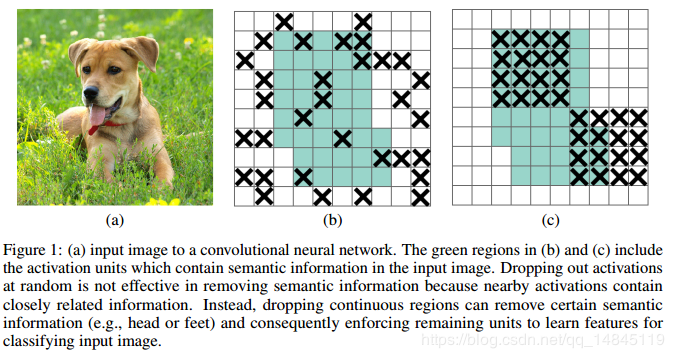

(a)原始输入图像

(b)绿色部分表示激活的特征单元，b图表示了随机dropout激活单元，但是这样dropout后，网络还会从drouout掉的激活单元附近学习到同样的信息

(c)绿色部分表示激活的特征单元，c图表示本文的DropBlock，通过dropout掉一部分相邻的整片的区域（比如头和脚），网络就会去注重学习狗的别的部位的特征，来实现正确分类，从而表现出更好的泛化。

dropblock有三个比较重要的参数，一个是block_size，用来控制进行归零的block大小；一个是γ，用来控制每个卷积结果中，到底有多少个channel要进行dropblock；最后一个是keep_prob，作用和dropout里的参数一样。

​		经过实验证明，block_size控制为7*7效果最好，对于所有的featuremap都一样，γ 通过一个公式来控制，keep_prob则是一个线性衰减过程，从最初的1到设定的阈值。

### 8.Class label smoothing

​		如果分类准确，交叉熵损失函数的结果是0，否则交叉熵为无穷大。也就是说交叉熵对分类正确给的是最大激励。换句话说，对于标注数据来说，这个时候我们认为其标注结果是准确的（不然这个结果就没意义了）。但实际上，有一些标注数据并不一定是准确的。那么这时候，使用交叉熵损失函数作为目标函数并不一定是最优的。

​		如果训练数据能覆盖所有情况，或者是完全正确，那么这种方式没有问题。但事实上，这不可能。所以这种方式可能会带来泛化能力差的问题，即过拟合。

​		label smoothing的原理就是为损失函数增强其他标签的损失函数值。类似于其为非标签的标签增加了一定概率的可选择性。

```
Label=((1-epsilon) * inputs) + (epsilon / K)
```

对于一个2分类的问题，如有一个样本属于第一类时，原来应该这么定义标签·[1 , 0] , 使用label smoothing后（epsilon=0.1）就变成了[ 1 ，0 ]*(1-0.1)+0.1/2 = [0.95 . 0.05] 。就是说增加了第二类的类别概率，而不是一棍子打死。

### 9.CIOU loss

以简洁明了的方式介绍iou，giou，diou，ciou

**iou**


**giou**

giou解决iou中，两框不相交的情况下（iou衡等于零），无法衡量损失

对于相交的框，IOU可以被反向传播，即它可以直接用作优化的目标函数。但是非相交的，梯度将会为0，无法优化。此时使用GIoU可以完全避免此问题。所以可以作为目标函数

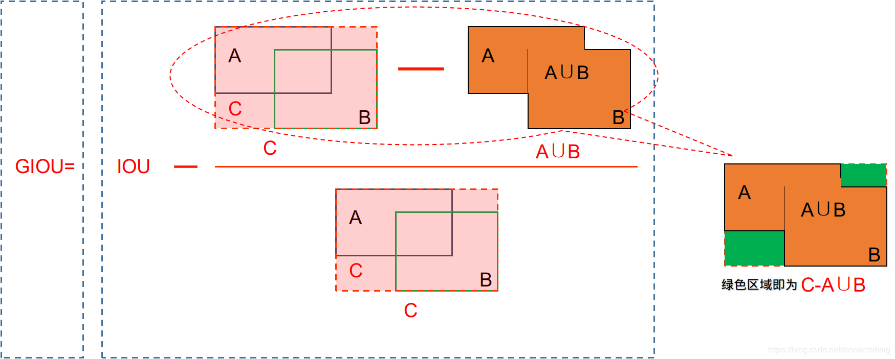

**diou**

giou也存在问题，如果存在如下图的情况时，giou会退化为iou

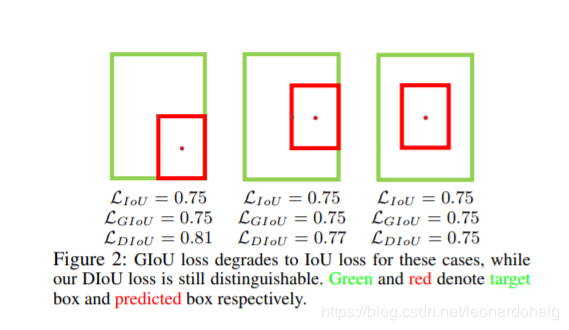

考虑换一种方式来衡量两个框之间远近的度量方式


`b，bgt`分别代表了anchor框和目标框的中心点，且`p`代表的是计算两个中心点间的欧式距离。`c`代表的是能够同时覆盖anchor和目标框的最小矩形的对角线距离。

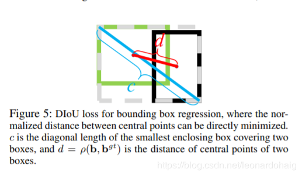

GIoU loss类似，DIoU loss在与目标框不重叠时，仍然可以为边界框提供移动方向。

DIoU loss可以直接最小化两个目标框的距离，而GIOU loss优化的是两个目标框之间的面积

**ciou**

一个好的目标框回归损失应该考虑三个重要的几何因素：重叠面积、中心点距离、长宽比。
GIoU：为了归一化坐标尺度，利用IoU，并初步解决IoU为零的情况。
DIoU：DIoU损失同时考虑了边界框的重叠面积和中心点距离。
CIOU：Complete-IoU Loss，anchor框和目标框之间的长宽比的一致性也是极其重要的。

CIOU Loss又引入一个box长宽比的惩罚项，该Loss考虑了box的长宽比，定义如下:


其中α是用于平衡比例的参数。v用来衡量anchor框和目标框之间的比例一致性。从α参数的定义可以看出，损失函数会更加倾向于往重叠区域增多方向优化，尤其是IoU为零的时候。

## 网络结构

​		我们在CSPDarknet53上添加SPP block，因为它能够显著增加感受野，分离出最重要的上下文特征且几乎没有降低网络的运行速度。我们使用PANet作为参数聚集的方法，而不是YOLOv3中使用的FPN。最后，我们使用CSPDarknet53的主干网络, SPP附加模块, PANet 以及YOLOv3的头部作为YOLOv4的框架。


### YOLOv4 consists of:

- Backbone: CSPDarknet53
- Neck: SPP, PAN
- Head: YOLOv3

#### PAN


​        总体上是Mask-Rcnn的改进版本，整体思路是提高信息流在网络中的传递效率。第一个改进：为了提高低层信息的利用率，加快低层信息的传播效率，提出了Bottom-up Path Augmentation；第二个改进：通常FPN在多层进行选anchors时，根据anchors的大小，将其分配到对应的层上进行分层选取。这样做很高效，但同时也不能充分利用信息了，提出了Adaptive Feature Pooling。第三个改进：为了提高mask的生成质量，作者将卷积-上采样和全连接层进行融合，提出了Fully-connected Fusion。

**1.Bottom-up Path Augmentation**

​        一般都知道，网络的低层特征中含有更多的位置信息，高层特征中含有更多的语义信息。FPN是网络在下采样结束后，再返回来进行上采样，并通过横向连接获取同级下采的信息。FPN做的就是将高层的语义信息回向传递，利用高层语义信息来提高低层的效果。Bottom-up Path Augmentation在此基础上又增加了一个低层到高层的通道，将低层信息直接向上进行传递，提高底层信息的利用率。
        上图中的b区域就是新增的Bottom-up Path Augmentation。红线是FPN中底层信息的传递路径，要经过100+layers。绿线是PANet的底层信息传递路径，经过的路径少于10层。

区别:PANet中使用的是add方法,yolo4中使用的concat方法(concat 能够提供更丰富的信息)

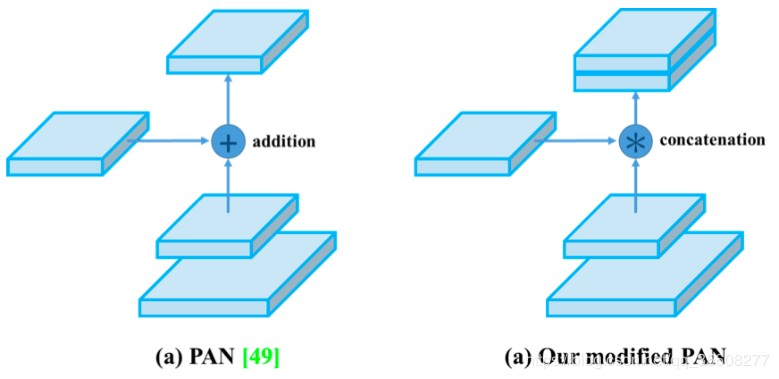

**2.Adaptive Feature Pooling**

​       低层特征中含有更多的位置信息，高层特征中含有更多的语义信息，根据proposal的大小将其划分到对应的层上，大的分配到高层上，小的分配到低层上。这会造成大的proposal只能更多的利用语义信息，小的proposal只能更多的利用位置信息，这当然会对精度造成影响，这是FPN的不足之处。

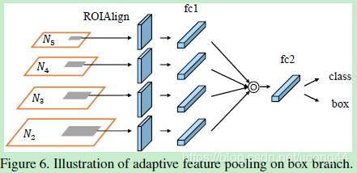

​       首先对于每个proposal来说，将其映射在不同的feature level上；然后用ROI Align,再利用融合操作（逐元素进行max或者sum）将不同层上的进行融合。

**3.Fully-connected Fusion**

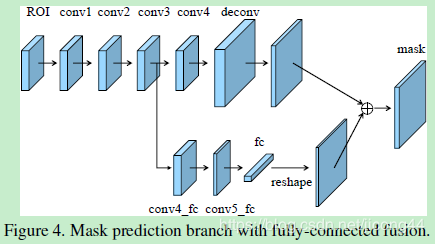

​		加入下层fc的原因：由于fc是通过大量的参数来预测特征图不同位置的，所以fc是位置敏感的。而且fc可以利用全局信息对各个子区域进行预测，有助于区分不同实例和识别属于同一对象的不同部分。

​		模块结构：上面是四个卷积加一个反卷积，卷积都是256个3*3的filter，上采样的倍数为2。mask预测的是前景/背景的二分类。增加的为下部分，从conv3引下来一个分支，该分支包含两个conv，一个fc和一个reshape。其中conv5_fc是将通道减半（由图看出来变薄了）的，fc要保证reshape后的特征图大小和上面的反卷积之后的特征图大小一致。

#### SPP


​		spp提出的初衷是为了解决CNN对输入图片尺寸的限制。由于全连接层的存在，与之相连的最后一个卷积层的输出特征需要固定尺寸，从而要求输入图片尺寸也要固定。spp-net之前的做法是将图片裁剪或变形（crop/warp）. 简而言之，即是将任意尺寸的feature map用三个尺度的金字塔层分别池化，将池化后的结果拼接得到固定长度的特征向量（图中的256为filter的个数），送入全连接层进行后续操作。后来的Fast RCNN网络即借鉴了spp的思想。其中的ROI Pooling可理解为单尺度的SPP层。

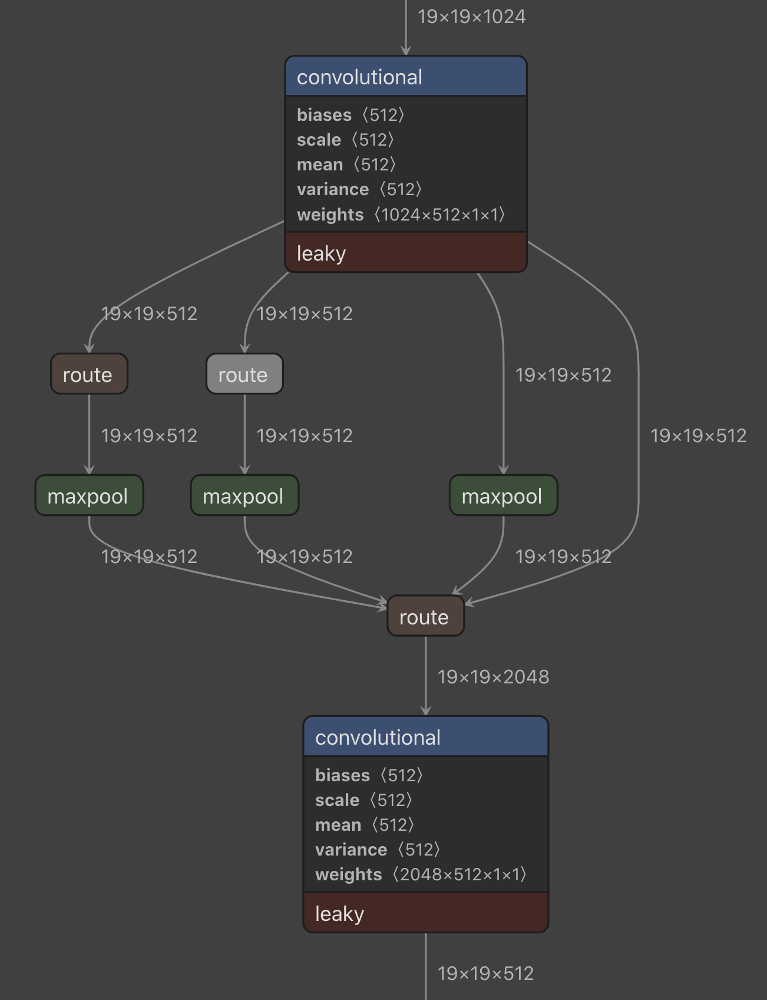

​		在yolo4中使用的是如上图的结构,池化的size分别为[1,5,,9,13],池化要保持特征图大小一致和通道数一致,再将池化后的特征进行concatenate.

### YOLO v4 uses:

- Bag of Freebies (BoF) for backbone: CutMix and Mosaic data augmentation, DropBlock regularization,Class label smoothing

- Bag of Specials (BoS) for backbone: Mish activation, Cross-stage partial connections (CSP), Multi-input weighted residual connections (MiWRC)

- Bag of Freebies (BoF) for detector: CIoU-loss,CmBN, DropBlock regularization, Mosaic data augmentation, Self-Adversarial Training, Eliminate grid sensitivity, Using multiple anchors for a single ground truth, Cosine annealing scheduler, Optimal hyper parameters, Random training shapes

- Bag of Specials (BoS) for detector: Mish activation,SPP-block, SAM-block, PAN path-aggregation block, DIoU-NMS

    

## 代码实现

代码完成度：

- [ ] 数据增强Mosaic data augmentation
- [x] kmeans
- [ ] 正则化DropBlock regularization
- [x] 类标签平滑Class label smoothing
- [ ] Cutmix

- [x] Mish 激活 Mish-activation
- [x] Cross-stage partial connections (CSP)
- [ ] Multi-input weighted residual connections (MiWRC)加权残差连接

- [x] 损失CIoU loss
- [ ] Cross mini-Batch Normalization (CmBN)
- [ ] 自对抗训练Self-adversarial-training (SAT)
- [ ] Eliminate grid sensitivity
- [ ] Using multiple anchors for a single ground truth
- [ ] Cosine annealing scheduler
- [ ] 使用遗传算法选择最优超参数Optimal hyper-parameters
- [ ] Random training shapes

- [x] SPP-block
- [ ] SAM-block
- [x] PAN path-aggregation block
- [ ] DIoU-NMS